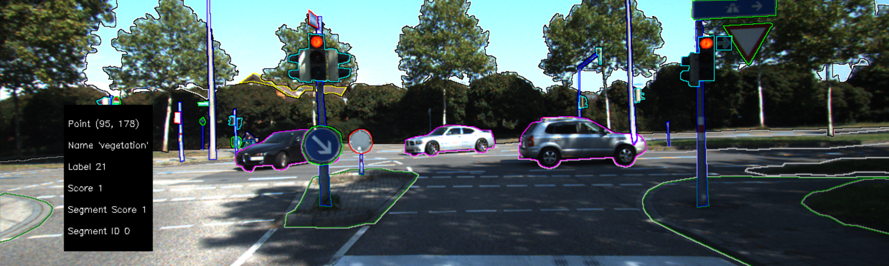

<p align="center">
    
</p>


# Semantic Segmentation GUI

An application implemented as two versions (in C++ and Python), which takes a semantic segmantion and its corresponding image as inputs, extracts each image segment from the segmentation and visualizes them in a GUI. Each pixel in the GUI is clickable, and that triggers a popup with metadata (seen in the image above) pertaining to that pixel.

## Preprocessing
To convert annotated Kitti segmentation data (shaped `H x W`), run:

```
$ python3 kitti_to_numpy.py --segmentation_path data/kitti/segmentation/000010_10.png
```

This will create a file `data/000010_10.npy` with the shape `H x W x NumClasses`, which will be used
as input to the application, along with the corresponding image `data/kitti/image_2/000010_10.png`.

## GUI
Actions:
```
+ Left mouse click      : Triggers popup with metadata
+ 'r'                   : Resets the frame
+ 'c' / 'q'             : Closes the application
```

## C++
### Setup
The application uses [cnpy](https://github.com/rogersce/cnpy) to read .npy files containing the semantic segmentation.
When installing this package I got the same error as [here](https://github.com/rogersce/cnpy/issues/34), but solved it using
the steps in [this answer](https://github.com/rogersce/cnpy/issues/34#issuecomment-401502398).

### Files
```
+ gui.{hpp/cpp}         : Methods pertaining to GUI operations (+ loading image and label file)
+ main.cpp              : Main file
+ pixel.{hpp/cpp}       : Class representing a pixel (contains label and score at that coordinate)
+ processor.{hpp/cpp}   : Extracts segments from the semantic segmentation
+ segment.{hpp/cpp}     : Class representing an image segment. Contains list of pixels and contour 
                          pixels that belong to said segment
+ semseg.{hpp/cpp}      : Class representing semantic segmentation
```

### Run
```
$ cd c++/
$ ./app ../data/kitti/image_2/000010_10.png ../data/000010_10.npy ../data/kitti/labels.txt
```

## Python
### Setup
Dependencies:
```
numpy
cv2
argparse
```

### Files
```
+ gui.py                : Methods pertaining to the GUI operations
+ main.py               : Main file
+ pixel.py              : Class representing a pixel (contains label and score at that coordinate)
+ processor.py          : Methods to extract segments from semantic segmentation
+ segment.{hpp/cpp}     : Class representing an image segment. Contains list of pixels and contour 
                          pixels that belong to said segment
+ utils.py              : Helper methods for loading and reading input data
```

### Run
```
$ cd python/
$ python3 main.py   --image_path ../data/kitti/image_2/000010_10.png \
                    --segmentation_path ../data/000010_10.npy \
                    --label_path ../data/kitti/labels.txt
```
